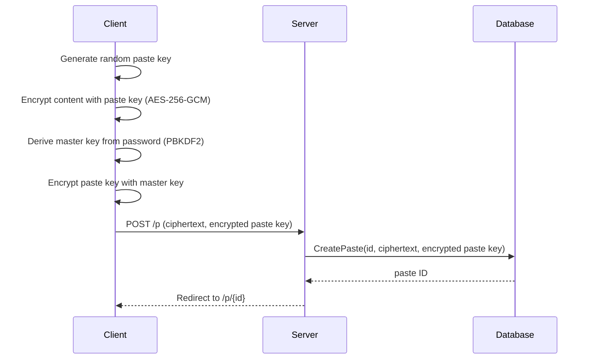
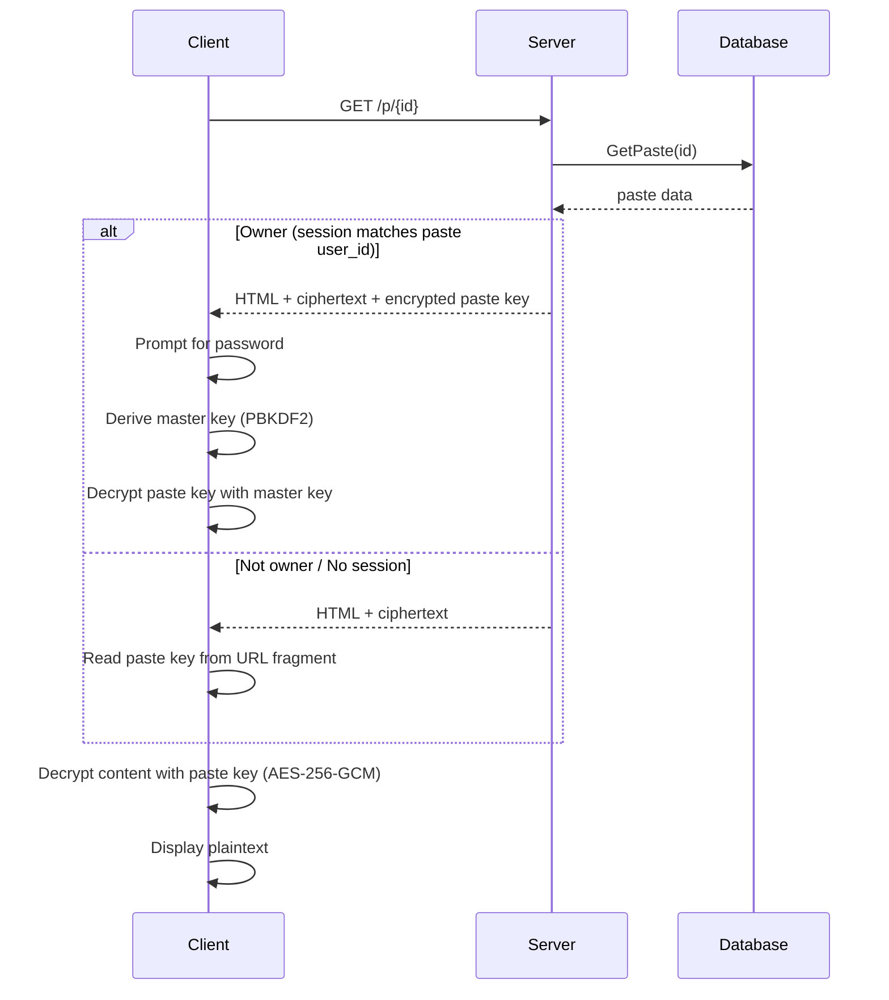
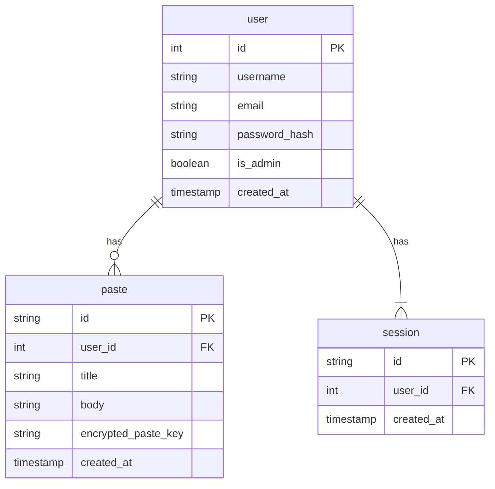

# Overview

**SecureBin** is an end-to-end encrypted pastebin. Content is encrypted client-side using _AES-256-GCM_ via the _Web Crypto API_. Each paste has its own key, which can be accessed either through the URL fragment (for sharing) or via a master key derived from the user's password (for account access). The server only stores the ciphertext and never sees plaintext, paste keys, or master keys. URL fragments are never sent to the server per [RFC 3986](https://www.rfc-editor.org/rfc/rfc3986#section-3.5).

# Technology Stack

The server is written in [Go](https://go.dev/) using the standard library's [`net/http`](https://pkg.go.dev/net/http) package with no framework. Templates are rendered server-side using the [`templ`](https://github.com/a-h/templ) package, with [HTMX](https://four.htmx.org/) handling dynamic interactions. HTMX v4 is used over the stable v2 release. Client-side encryption uses the [Web Crypto API](https://developer.mozilla.org/en-US/docs/Web/API/Web_Crypto_API) for _AES-256-GCM_ encryption and PBKDF2 key derivation. [SQLite](https://sqlite.org/) for the database, accessed via [SQLC](https://sqlc.dev/) for type-safe query generation and [golang-migrate](https://pkg.go.dev/github.com/golang-migrate/migrate/v4) for schema migrations. Authentication uses [bcrypt](https://pkg.go.dev/golang.org/x/crypto/bcrypt) password hashing and cookie-based sessions. The application is containerised with a multi-stage [Docker](https://www.docker.com/) build and uses [GitHub Actions](https://github.com/features/actions) for CI.

| Layer                  | Technology                                                                                      |
| ---------------------- | ----------------------------------------------------------------------------------------------- |
| Language               | [Go](https://go.dev/)                                                                           |
| Templating             | [templ](https://github.com/a-h/templ)                                                           |
| Styling                | [Tailwind CSS](https://tailwindcss.com/) (CDN)                                                   |
| Interactivity          | [HTMX v4](https://four.htmx.org/)                                                               |
| Client-side encryption | WebCrypto API (AES-256-GCM, PBKDF2)                                                             |
| Database               | [SQLite](https://sqlite.org/) via [`modernc.org/sqlite`](https://pkg.go.dev/modernc.org/sqlite) |
| Query Generation       | [SQLC](https://sqlc.dev/)                                                                       |
| Migrations             | [`golang-migrate`](https://pkg.go.dev/github.com/golang-migrate/migrate/v4)                     |
| Authentication         | [bcrypt](https://pkg.go.dev/golang.org/x/crypto/bcrypt), cookie-based sessions                  |
| Containerisation       | [Docker](https://www.docker.com/)                                                               |
| CI                     | [GitHub Actions](https://github.com/features/actions)                                           |
| Dev tooling            | [Air](https://github.com/air-verse/air)                                                         |

# Project Management

Development is tracked using GitHub Issues and follows a docs-first TDD workflow. Each feature starts as an issue, is developed on a branch following the [conventional branch naming scheme](https://conventional-branch.github.io/), and is merged via squash merge PR that references and closes the issue.

# Project Structure

```
├── cmd/server/main.go          # Application entry point
├── Dockerfile                  # Multi-stage production build
├── docs/                       # Project documentation
├── internal/
│   ├── db/
│   │   ├── migrations/         # DB table schemas, used by golang-migrate
│   │   └── queries/            # SQLC query definitions (source of truth for internal/db/)
│   ├── contextkeys/            # typed context key constants
│   ├── templates/              # templ components and generated Go code
│   ├── testutil/               # utilities for tests
│   └── handlers/               # HTTP handlers
├── static/                     # Client-side assets (JS, images)
├── sqlc.yaml                   # SQLC configuration
├── go.mod
└── go.sum
```

# Request Flow

## Create Paste



## Read Paste



# Data Model



# Handler Convention

Handlers are methods on the `Handler` struct, which holds shared dependencies injected via the constructor.

```go
type Handler struct {
    queries *db.Queries     // SQLC Queries
}

func New(queries *db.Queries) *Handler {
    return &Handler {
        queries: queries,
    }
}
```

Each feature has its own file and corresponding test file (e.g. `register.go`, `register_test.go`). Handlers use two naming prefixes:

- `Page`: Serves a full HTML page (GET requests), e.g. `PageLogin`
- `Handle`: Processes a form submission and returns a redirect or HTMX fragment (POST requests), e.g. `HandleLogin`

Routes are registered via a `NewRouter` method that returns a ready to use `http.Handler`:

```go
func (h *Handler) NewRouter() http.Handler {
    mux := http.NewServeMux()

    // Pages
    mux.HandleFunc("GET /admin", h.auth(h.admin(h.PageAdmin)))
    //...

    // Actions
    mux.HandleFunc("POST /p", h.auth(h.htmx(h.HandleCreatePaste)))
    //...

    return h.log(mux)
}
```

Handlers are tested using integration tests with an in-memory SQLite database. A shared test helper in `internal/testutil/` sets up the database, runs migrations, and returns a `*db.Queries` ready for testing. Tests use `httptest.NewRequest` and `httptest.NewRecorder`.

# Template Organisation

Templates use [templ](https://github.com/a-h/templ), a type-safe HTML templating language for Go. Templ files (`.templ`) compile into Go functions, providing compile-time type checking and IDE support. Generated `_templ.go` files live alongside their `.templ` source and are committed to version control. Regenerate with `templ generate`.

All templates live in a single `internal/templates/` package. Each feature gets one `.templ` file containing both its page and fragment components. Shared private helper components (e.g. `registerForm`) stay in their feature file.

```
internal/templates/
├── base.templ
├── feed.templ
├── login.templ
├── register.templ
└── ...
```

`base.templ` defines a shared layout component that page components wrap themselves with, and a `navigation` component that renders the nav bar based on auth state read from context.

Templates are rendered via `RenderTemplate`, which resolves auth state from context (set by middleware) or falls back to a cookie/session lookup for public routes. It stores a `*db.User` on the context via `contextkeys.UserCtxKey`, which `base.templ` reads to render the nav bar:

```go
// Page handler
func (h *Handler) PageLogin(w http.ResponseWriter, r *http.Request) {
    h.RenderTemplate(w, r, templates.Login(""), http.StatusOK)
}

// Action handler returning a fragment
func (h *Handler) HandleLogin(w http.ResponseWriter, r *http.Request) {
    // ... validate login ...
    h.RenderTemplate(w, r, templates.LoginCallback("invalid username or password"), http.StatusUnauthorized)
}
```

