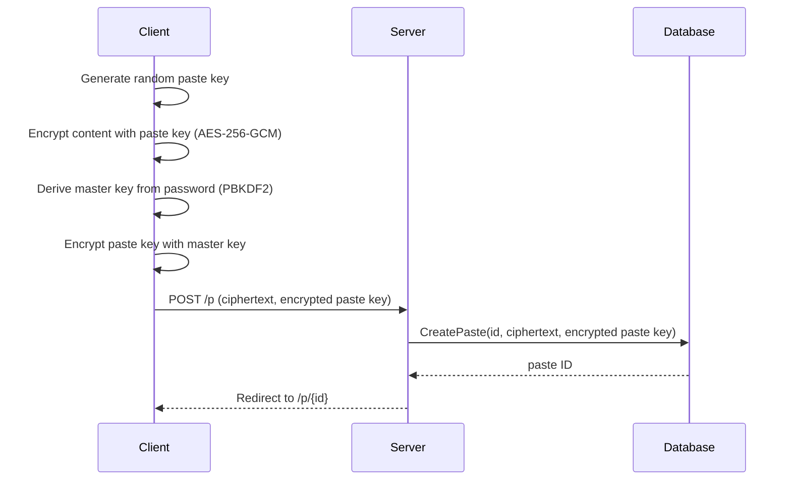
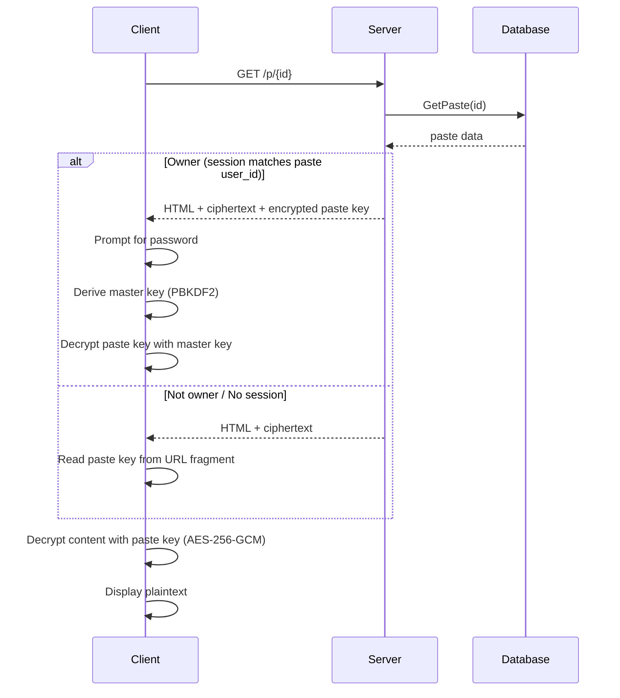
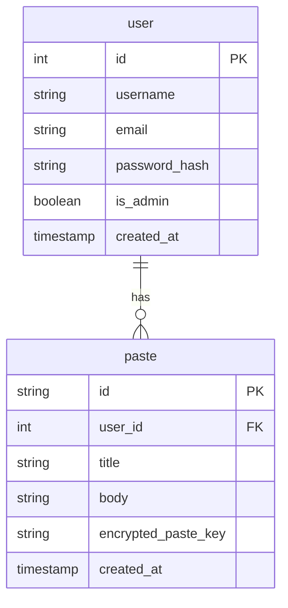

# Overview

**SecureBin** is an end-to-end encrypted pastebin. Content is encrypted client-side using _AES-256-GCM_ via the _Web Crypto API_. Each paste has its own key, which can be accessed either through the URL fragment (for sharing) or via a master key derived from the user's password (for account access). The server only stores the ciphertext and never sees plaintext, paste keys, or master keys. URL fragments are never sent to the server per [RFC 3986](https://www.rfc-editor.org/rfc/rfc3986#section-3.5).

# Technology Stack

The server is written in [Go](https://go.dev/) using the standard library's [`net/http`](https://pkg.go.dev/net/http) package with no framework. Templates are rendered server-side using the [`html/template`](https://pkg.go.dev/html/template) package, with [HTMX](https://four.htmx.org/) handling dynamic interactions. HTMX v4 is used over the stable v2 release. Client-side encryption uses the [Web Crypto API](https://developer.mozilla.org/en-US/docs/Web/API/Web_Crypto_API) for _AES-256-GCM_ encryption and PBKDF2 key derivation. [SQLite](https://sqlite.org/) for the database, accessed via [SQLC](https://sqlc.dev/) for type-safe query generation and [golang-migrate](https://pkg.go.dev/github.com/golang-migrate/migrate/v4) for schema migrations. Authentication uses [bcrypt](https://pkg.go.dev/golang.org/x/crypto/bcrypt) password hashing and cookie-based sessions. The application is containerised with a multi-stage [Docker](https://www.docker.com/) build and uses [GitHub Actions](https://github.com/features/actions) for CI.

| Layer                  | Technology                                                                                      |
| ---------------------- | ----------------------------------------------------------------------------------------------- |
| Language               | [Go](https://go.dev/)                                                                           |
| Templating             | Go [`html/template`](https://pkg.go.dev/html/template)                                          |
| Interactivity          | [HTMX v4](https://four.htmx.org/)                                                               |
| Client-side encryption | WebCrypto API (AES-256-GCM, PBKDF2)                                                             |
| Database               | [SQLite](https://sqlite.org/) via [`modernc.org/sqlite`](https://pkg.go.dev/modernc.org/sqlite) |
| Query Generation       | [SQLC](https://sqlc.dev/)                                                                       |
| Migrations             | [`golang-migrate`](https://pkg.go.dev/github.com/golang-migrate/migrate/v4)                     |
| Authentication         | [bcrypt](https://pkg.go.dev/golang.org/x/crypto/bcrypt), cookie-based sessions                  |
| Containerisation       | [Docker](https://www.docker.com/)                                                               |
| CI                     | [GitHub Actions](https://github.com/features/actions)                                           |
| Dev tooling            | [Air](https://github.com/air-verse/air)                                                         |

# Project Management

Development is tracked using GitHub Issues and follows a docs-first TDD workflow. Each feature starts as an issue, is developed on a branch following the [conventional branch naming scheme](https://conventional-branch.github.io/), and is merged via squash merge PR that references and closes the issue.

# Project Structure

```
├── cmd/server/main.go          # Application entry point
├── Dockerfile                  # Multi-stage production build
├── docs/                       # Project documentation
├── internal/
│   ├── db/
│   │   ├── migrations/         # DB table schemas, used by golang-migrate
│   │   └── queries/            # SQLC query definitions (source of truth for internal/db/)
│   ├── errors/                 # Sentinel error definitions
│   └── handlers/               # HTTP handlers
├── static/                     # Client-side assets (CSS, JS, images)
├── templates/
│   ├── pages/                  # Full page templates
│   └── fragments/              # HTMX partial responses
├── sqlc.yaml                   # SQLC configuration
├── go.mod
└── go.sum
```

# Request Flow

## Create Paste



## Read Paste



# Data Model



# Handler Convention

Handlers are methods on the `Handler` struct, which holds shared dependencies injected via the constructor. Templates are parsed once at startup and stored on the struct for reuse across requests

```go
type Handler struct {
    queries *db.Queries     // SQLC Queries
    pages *pages            // HTML Page Templates
    fragments *fragments    // HTMX Fragment Templates
}

func New(queries *db.Queries) *Handler {
    return &Handler {
        queries: queries,
        pages: &pages {
            login: registerTemplate("templates/pages/base.html", "templates/pages/login.html")
        },
        fragments: &fragments {
            login: registerTemplate("templates/fragments/login_callback.html")
        }
    }
}
```

Each feature has its own file and corresponding test file (e.g. `register.go`, `register_test.go`). Handlers use two naming prefixes:

- `Page`: Serves a full HTML page (GET requests), e.g. `PageLogin`
- `Handle`: Processes a form submission and returns a redirect or HTMX fragment (POST requests), e.g. `HandleLogin`

Routes are registered via a `NewRouter` method that returns a ready to use `http.Handler`:

```go
func (h *Handler) NewRouter() http.Handler {
    mux := http.NewServeMux()

    // Pages
    mux.HandleFunc("GET /admin", h.auth(h.admin(h.PageAdmin)))
    //...

    // Actions
    mux.HandleFunc("POST /p", h.auth(h.htmx(h.HandleCreatePaste)))
    //...

    return h.log(mux)
}
```

Handlers are tested using integration tests with an in-memory SQLite database. A shared test helper in `testhelper_test.go` sets up the database, runs migrations, and returns a `Handler` ready for testing. Tests use `httptest.NewRequest` and `httptest.NewRecorder`.

# Template Organisation

Templates are split into two directories:

- `templates/pages/` - full HTML pages served by `Page` handlers. Each page is a complete HTML document.
- `templates/fragments/` - partial HTML snippets served by `Handle` handlers. These are swapped into the page by HTMX without a full page reload

Pages use Go's `html/template` inheritance via `{{template}}` and `{{block}}` to share common base layout:

```
templates/
├── fragments
│   ├── login_callback.html
│   ├── create_paste_callback.html
│   └── ...
└── pages
    ├── base.html
    ├── index.html
    ├── login.html
    ├── new_paste.html
    └── ...
```

`base.html` defines the common structure: HTML head, navigation, footer, HTMX and encryption script includes. Page templates extend it by filling in the content block.
Fragment templates are standalone snippets with no layout. They're injected into an already rendered page via HTMX.

`registerTemplate` accepts a variadic number of paths, pages will need to include the base layout explicitly (`go doc -u ./internal/handlers registerTemplate`)

# Error Handling

Errors are handled at the handler level. Each handler is responsible for logging the error and returning an appropriate HTTP response. Internal errors are logged with `slog` for debugging. User facing responses reveal no implementation details to avoid attacks such as user enumeration.

Sentinel errors are defined as needed in a central `internal/errors/errors.go` file. Common cases like "not found" map directly to `sql.ErrNoRows` from the standard library and don't need a custom error. Custom sentinel errors are only introduced when the application needs to express something the standard library doesn't:

```go
package errors

import "errors"

var (
    ErrDuplicateEmail = errors.New("email already registered")
    ErrInvalidInput   = errors.New("invalid input")
)
```

Handlers check for errors and map them to HTTP responses:

```go
func (h *Handler) HandleLogin(w http.ResponseWriter, r *http.Request) {
    ctx := r.Context()
    username := r.FormValue("username")
    password := r.FormValue("password")

    user, err := h.queries.GetUserByEmailOrUsername(ctx, username)
    if err != nil {
        if errors.Is(err, sql.ErrNoRows) {
            slog.Warn("login failed", "username", username)
            h.fragments.loginCallback.Execute(w, map[string]string{"Error": "invalid username or password"})
            return
        }
        slog.Error("database error", "error", err)
        http.Error(w, "something went wrong", http.StatusInternalServerError)
        return
    }

    // check password with bcrypt...
}
```

Key principles:

- Authentication failures (wrong password, email not found) return the same generic message to the user to prevent account enumeration
- Database and internal errors log the detail with `slog.Error` and return a generic 500 to the user.
- Validation errors (missing fields, invalid format) return specific feedback so the user can correct their input
- HTMX action handlers return error fragments that swap into the form. Page handlers return a full error page.
